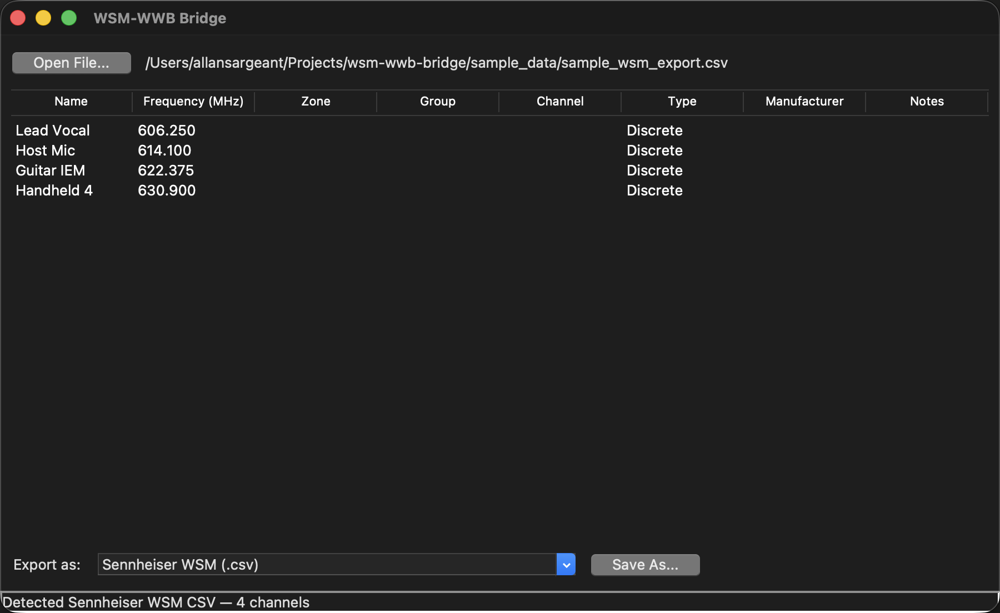
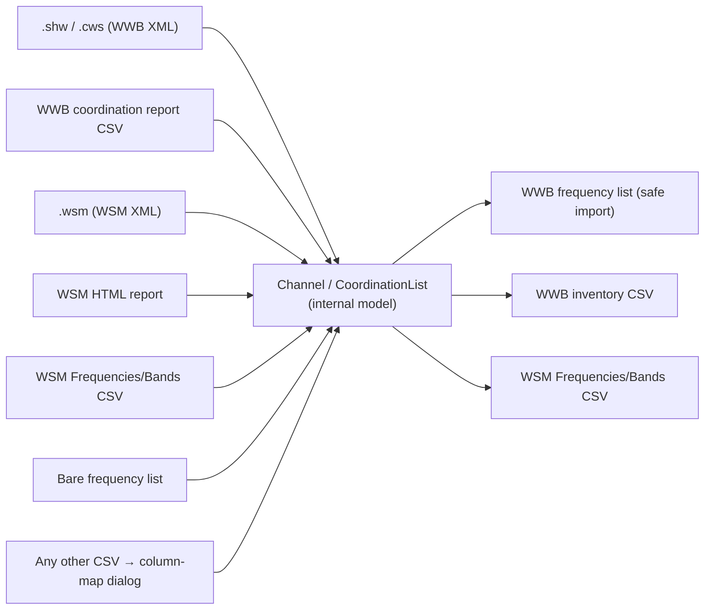

# WSM-WWB Bridge

[](https://github.com/allansargeant/wsm-wwb-bridge/actions/workflows/test.yml)
[](https://github.com/allansargeant/wsm-wwb-bridge/actions/workflows/release.yml)
[](LICENSE)

> **AI-assisted project.** This codebase was created with [Claude](https://claude.com/claude-code)
> (Anthropic), directed and reviewed by a human author. Every format parser was
> reverse-engineered from real exports rather than from official documentation, since
> neither vendor publishes full schemas for most of these files — verify against your
> own WWB/WSM versions before relying on this for a live show.

Moves radio mic frequency coordination data between Shure Wireless Workbench
(WWB) and Sennheiser Wireless Systems Manager (WSM) — plus any other tool
that can produce a CSV, via a generic column-mapping importer.



Everything routes through one internal channel model, so any supported input
format can be re-exported as any supported output format:



## Run it

```
./run.sh
```

Optionally pass a file to open it immediately: `./run.sh sample_data/sample_wwb_report.csv`.
On macOS, dropping a file onto the `.app` icon does the same thing.

On macOS, run via `run.sh` rather than calling `python3 main.py` directly if
your `python3` resolves to Apple's system/Command Line Tools install — it
bundles Tcl/Tk 8.5.9, which has well-documented bugs on modern macOS
(blank, non-rendering, unresponsive windows). `run.sh` prefers a Homebrew
Python if one's on your machine and warns if it has to fall back to a
broken Tk version. If you hit that warning: `brew install python-tk`.

No dependencies beyond the Python 3 standard library (uses `tkinter`, which
ships with the standard macOS/python.org installer).

## Unsigned prebuilt binaries — macOS Gatekeeper & Windows SmartScreen

If you'd rather grab the prebuilt release binary than run from source, note it
is **not code-signed or notarized** — that needs paid Apple / Windows developer
certificates this project doesn't carry. It's safe to run; the OS just can't
verify a publisher, so it warns you the first time.

### macOS

The macOS build is a `wsm-wwb-bridge.app` bundle. On first launch macOS says it
**"is damaged"** or **"cannot be opened because the developer cannot be
verified"** — that's Gatekeeper reacting to the missing signature. Easiest fix:
**right-click (Control-click) the app → Open → Open** (once). If it still says
*"damaged"*, clear the quarantine flag:

```sh
xattr -dr com.apple.quarantine "wsm-wwb-bridge.app"
```

### Windows

The `wsm-wwb-bridge.exe` may trip SmartScreen (**"Windows protected your PC"**) →
**More info → Run anyway**. Or right-click → **Properties** → **Unblock** →
**OK**.

### Linux

No signing gate — `chmod +x` the binary (or install the `.deb`/`.rpm`).

### Signing it yourself (optional)

macOS ad-hoc (local only, not notarized):

```sh
codesign --force --deep --sign - "wsm-wwb-bridge.app"
```

Distributing without warnings needs an **Apple Developer Program** membership
($99/yr) + a *Developer ID Application* certificate — sign with the hardened
runtime and notarize the zipped `.app` with `xcrun notarytool submit … --wait`,
then `xcrun stapler staple`. On Windows, clearing SmartScreen needs an
Authenticode code-signing certificate (`signtool sign`).

## Testing

```
./test.sh
```

123 tests covering every parser/writer — frequency notation edge cases,
the WWB report's zone/primary/backup state machine, WWB's native XML
(`.shw`/`.cws`), WSM's native `.wsm` project file (including the
`AllocatedFrequency` vs. decoy `CurrentFrequency` distinction), the WSM
HTML report (including its malformed `&microV` entity), and round-trips
through every writer. None of it touches `gui.py` (Tkinter, no headless
display in CI) — the parsing/formatting logic underneath it is what's
covered. Runs automatically on push via GitHub Actions.

## How it works

1. **Open File...** loads a file and auto-detects its shape:
   - Sennheiser WSM's documented CSV export schema (semicolon-delimited, `Name;Type;Frequency;...`)
   - Sennheiser WSM's native `.wsm` project file
   - Sennheiser WSM's HTML "Coordination Report" export
   - Shure WWB's native `.shw` (Show) or `.cws` (Coordination Workspace) XML files
   - Shure WWB's printable "Coordination report" CSV
   - A bare list of frequencies (what WWB's "Import Frequencies from File" both produces and consumes)
   - Anything else: a column-mapping dialog appears so you tell it which
     column is Name, Frequency, Group, etc.
2. Preview the parsed channel list in the table (Name, Frequency, Zone, Group, Channel, Type, Manufacturer, Notes).
3. Pick an export format and **Save As...**.

## Format notes

Neither Shure nor Sennheiser publish schemas for most of these. Everything
below was built by inspecting real exports (from blank "demo" projects,
not published in this repo since they're real device/coordination data),
then cross-checking two independent formats from the same project against
each other to confirm the parsing was right.

### Shure WWB (WWB 7.8.2.63)

- **`.shw` / `.cws` (native XML)** — WWB's real save formats.
  `.shw` ("Show") contains the full device inventory: per-device,
  per-physical-channel `channel_name` / `frequency` / `group_channel` —
  i.e. what's actually deployed on the gear (`wwb_xml.read_shw_inventory`).
  `.cws` ("Coordination Workspace") contains `mic_channels/freq_entry` — the
  coordination engine's full candidate frequency pool across all RF zones
  (`wwb_xml.read_cws_candidates`). A `.shw` embeds the same workspace data
  too; the reader prefers the deployed device inventory when present.
  Neither format exposes a documented "is this a primary or backup pick"
  flag at the XML level — only the printed report does. Dozens of
  unrelated sections (Dante config, monitor layouts, scan plots, zone
  compatibility matrices) are ignored.
- **Coordination report CSV** (`wwb_report.py`) — WWB's printable/exportable
  report. Structured as repeating sections per RF zone ("Primary
  frequencies" / "Backup frequencies"), each broken into inclusion-group
  subheaders, with `Type,Band,Channel name,Group & Channel,Frequency`
  columns. This *is* where primary vs. backup is explicit, so it's the best
  source for "what am I actually using" vs. "what's in the spare pool."
  Verified against a real 291-channel export (44 primary + 247 backup
  across 3 zones — matches the file's own section counts exactly). It's a
  print report, not something WWB imports back in.
- **"Import Frequencies from File"** — the one thing Shure documents: a
  bare list of MHz values, comma/tab/CR-separated, no names or groups.
  This is the only WWB-side format guaranteed importable, so it's
  `write_wwb_frequency_list()` in `wwb.py` and stays the default/safe
  export choice for the WSM → WWB direction.
- **WWB inventory CSV** (`write_wwb_inventory_csv`) — a best-effort flat
  CSV (Name, Frequency, Group, Channel, Type...) for round-tripping with
  this tool; not a real WWB format.

**Writing `.shw`/`.cws` back out is intentionally not implemented.** Those
files have many interdependent sections (compatibility profiles, band
planning, zone matrices) beyond channel data; generating one from scratch
risks producing a file WWB can't open cleanly. Reading them is safe and
implemented; the safe way to get data *into* WWB remains the frequency-list
import.

### Sennheiser WSM (WSM 4.9.0.13)

- **`.wsm` (native project file)** (`wsm_xml.py`) — has two frequency
  fields per port and they are *not* interchangeable: `CurrentFrequency`
  sat at the receiver's default in a real coordinated project (didn't
  reflect the coordination result at all), while
  `FrequencyManager/Devices/Device/AllocatedFrequency` — one entry per
  logical mic/IEM channel with Name, receiver model (StationaryDeviceType),
  transmitter model (PortableDeviceType) — matched the real result. That's
  what's read.
- **HTML "Coordination Report"** (`wsm_html.py`) — a `Devices:` section
  with one table per device category (FM Mics / IEM Systems / Digital
  devices / etc.), columns `#, Name, Stationary device, Frequency range,
  Frequency, Portable device, Squelch/Max.noise`. Parsed with the stdlib
  `html.parser` rather than an XML parser since the document isn't
  well-formed XML. Cross-checked against a same-project `.wsm` file: both
  produced the identical 11 channels and frequencies.
- **"Frequencies/Bands" CSV export** (`wsm.py`) — real schema confirmed
  against an actual export: lowercase, semicolon-delimited
  `name;type;frequency;tolerance;minfrequency;maxfrequency;priority;squelchlevel`,
  frequencies in kHz (this differs from Sennheiser's own docs, which imply
  mixed-case headers and different column names — the real file wins).
  **This is not a coordinated channel list.** The one real sample had
  `minfrequency`/`maxfrequency` spanning 400–4000 MHz — a whole-spectrum
  band/scan-range definition, not one mic's frequency. This format is for
  feeding a *candidate frequency pool* into WSM, which you then run through
  WSM's own "Start Coordination" and manually drag-allocate onto device
  channels — it doesn't write directly to named channels. For actual
  per-channel coordinated frequencies, use `wsm_xml.py` or `wsm_html.py`
  instead (both verified against real per-channel data). The `type` column
  is a numeric enum (band/discrete/interference/usable/unusable per the
  HTML report's legend); confirmed against two real samples — `type=2` for
  a whole-spectrum band, `type=0` for a manually-created discrete-frequency
  entry (with `minfrequency == maxfrequency == frequency`, matching what
  `write_wsm_csv()` already produces). `DEFAULT_TYPE = "0"` in `wsm.py` is
  now verified, not a guess.

Because several of these formats aren't documented, the importer falls
back to a manual column-mapping dialog for any file it doesn't recognize.

## Project layout

```
wsm_wwb_bridge/
  model.py       Channel / CoordinationList — the internal representation
                 (includes zone / inclusion_group / is_backup, used by WWB)
  freq_parse.py  Frequency + WWB group/channel notation parsing
  csv_generic.py Delimiter sniffing + fuzzy header-to-field mapping
  wsm.py         Sennheiser WSM "Frequencies/Bands" CSV (candidate pool, not
                 per-channel data — real format, see caveats above)
  wsm_xml.py     Sennheiser WSM native .wsm project file parser (real format)
  wsm_html.py    Sennheiser WSM HTML coordination report parser (real format)
  wwb.py         Shure WWB frequency-list + best-effort inventory CSV
  wwb_report.py  Shure WWB "Coordination report" CSV parser (real format)
  wwb_xml.py     Shure WWB native .shw / .cws XML parser (real format)
  detect.py      Guesses which parser to use for a loaded file
  gui.py         Tkinter app
tests/                  Unit tests — run with ./test.sh, see Testing above
sample_data/            Synthetic example files for each format
```

(Real WWB 7.8.2.63 and WSM 4.9.0.13 exports were used locally to build and
cross-validate the parsers above, but aren't published here since they're
real device/coordination data.)

Every format this tool reads or writes has now been checked against at
least one real export from the corresponding app; there's no remaining
placeholder/guessed field.
